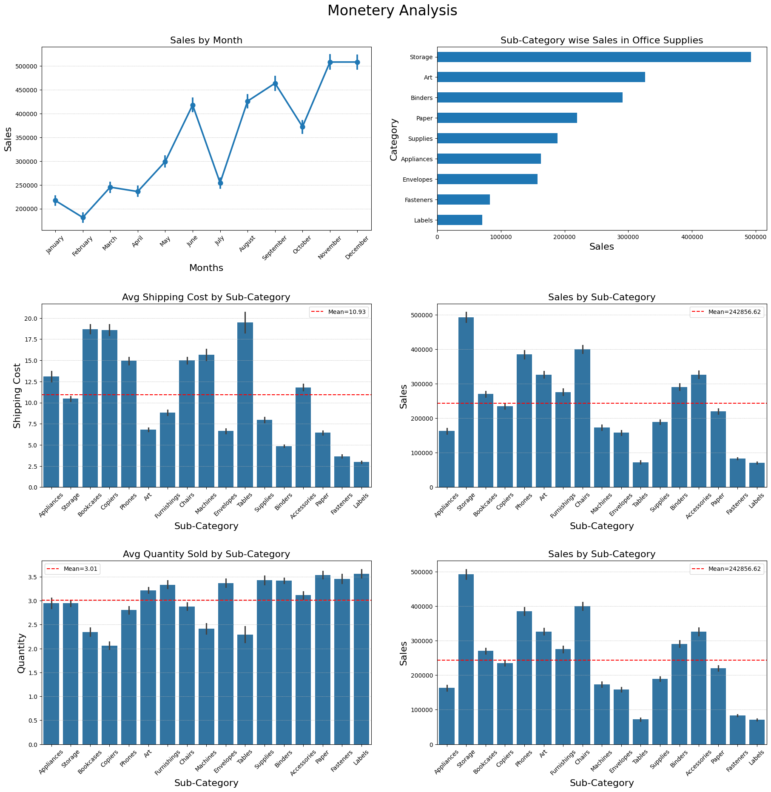
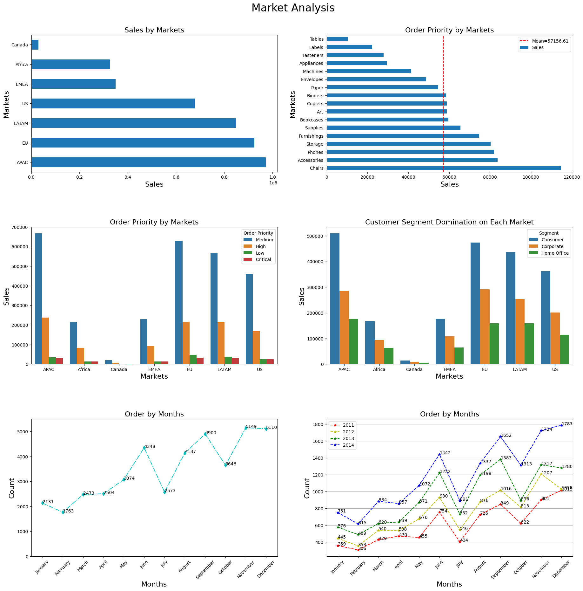
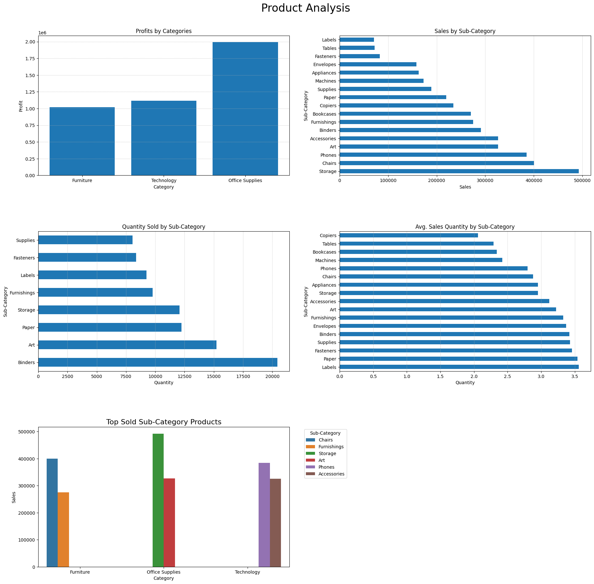

# E-commerce Sales — Data Analysis 📊

Summary
-------
This project analyzes an e-commerce transactions dataset to surface product, customer and market insights that can guide inventory planning, marketing, and pricing decisions. The analysis is implemented in a Jupyter notebook using Python (pandas, numpy, matplotlib, seaborn, scipy). It includes data cleaning, feature engineering, exploratory data analysis (EDA), outlier handling, category & market analysis, and practical business recommendations.

Notebook highlights
------------------
- File read: `E-commerce Sales.csv`
- Rows × columns (original): 51,290 × 19
- No missing values; no row-level duplicates detected
- Datetime conversion for `Order Date` and `Ship Date`
- New features created: `Order_Month`, `Order_Day`, `Order_Year`
- Outlier handling: IQR-based removal for `Sales` and `Shipping Cost` (removed outliers saved separately)
- Working dataset after outlier removal: 41,808 records

Dataset (expected columns)
--------------------------
Row ID, Order ID, Order Date, Ship Date, Ship Mode, Customer ID, Segment, City, State, Country, Market, Region, Product ID, Category, Sub-Category, Sales, Quantity, Shipping Cost, Order Priority

Key numeric summary after outlier removal
----------------------------------------
- Records: 41,808
- Sales: mean ≈ 98.75, std ≈ 105.96, min = 0.44, max ≈ 581.04
- Quantity: mean ≈ 3.19
- Shipping Cost: mean ≈ 8.74

What was done (methodology)
---------------------------
1. Load CSV into a pandas DataFrame and inspect data (`.head()`, `.info()`, `.describe()`).
2. Convert date columns to datetime; extract month name, weekday and year for time-based analyses.
3. Check for nulls and duplicates.
4. Visualize distributions and detect outliers (boxplots, histograms, skewness, kurtosis).
5. Remove outliers using IQR method for `Sales` and `Shipping Cost`. Removed rows stored in `outlier_df_dict`.
6. Aggregations and EDA:
   - Category & sub-category sales and quantities
   - Monthly sales trends and month-by-year comparisons
   - Market-level analysis (sales, dominant segments, order priority)
   - Shipping cost vs. sales, and sales vs. average quantity
7. Plot results (bar charts, point plots, multi-panel figures) and derive business recommendations.

Main findings & insights
------------------------
Product & Category insights
- Total sales by Category:
  - Office Supplies: 1,992,389.80
  - Technology: 1,118,453.37
  - Furniture: 1,017,719.42
  - Combined total sales ≈ 4,128,562.59
- Top sub-categories by sales:
  - Storage: 492,509.26
  - Chairs: 400,110.19
  - Phones: 384,896.05
  - Art: 326,355.36
  - Accessories: 326,100.03
- Highest total quantity sold (by sub-category): Binders (20,431 units)
- Some sub-categories generate high revenue with relatively low average quantity per order (Bookcases, Phones, Chairs, Storage) — candidates for focused margin/inventory management.

Monetary & shipping insights
- Top month by sales: December (508,172.66)
- Lowest month by sales: February (181,454.58)
- Sub-categories with relatively high average shipping cost but low total sales (opportunity to review logistics/pricing): Tables, Copiers, Machines, Appliances
- Sub-categories with low quantity but high revenue: Bookcases, Phones, Chairs, Storage — high price-per-unit items.

Market & customer insights
- Sales by Market (descending):
  - APAC: 971,662.39
  - EU: 924,911.76
  - LATAM: 848,998.17
  - US: 678,280.96
  - EMEA: 349,721.80
  - Africa: 325,225.17
  - Canada: 29,762.34
- In APAC (top market), the highest sub-category was Chairs (114,727.08).
- Customer Segment domination: `Consumer` segment leads sales across all markets (notably APAC with consumer sales ≈ 509,295.40).
- Order priority: `Medium` is the most-used order priority across markets.

Top operational insights (quick actions)
---------------------------------------
- Prioritize inventory for top-selling sub-categories (Storage, Chairs, Phones) and ensure supply chain readiness for December spikes.
- Re-evaluate shipping rates, sourcing, or bundling for sub-categories with high shipping costs but low sales (Tables, Copiers, Machines, Appliances).
- Tailor marketing and retention programs for Consumer segment (the dominant customer group).
- Consider premium-service promotions or targeted offers for low-quantity/high-revenue SKUs to maximize margin.
- Monitor slow-moving SKUs (e.g., Labels, Fasteners) for discounts, bundling or delisting.

Code & analysis notes (important snippets)
-----------------------------------------
- Date parsing & feature creation:
  - file['Order Date'] = pd.to_datetime(file['Order Date'], format='mixed')
  - file['Order_Month'] = file['Order Date'].dt.month_name()
  - file['Order_Day'] = file['Order Date'].dt.day_name()
  - file['Order_Year'] = file['Order Date'].dt.year
- Outlier removal (IQR method):
  - Q1, Q3 = file[col].quantile(0.25), file[col].quantile(0.75)
  - IQR = Q3 - Q1
  - LB, UB = Q1 - 1.5*IQR, Q3 + 1.5*IQR
  - outliers = file[(file[col] < LB) | (file[col] > UB)]
  - file.drop(outliers.index, inplace=True)

Visualizations
--------------
The notebook includes:
- Category & sub-category bar charts (total sales, average quantity)
- Monthly sales point plots and month-by-year trend comparisons
- Market-level horizontal bar charts
- Boxplots and histograms to spot distributions and outliers
- Multi-panel summary figures combining related plots for reporting

## 📸 Dashboard Preview

Business recommendations (prioritized)
--------------------------------------
1. Inventory & promotions:
   - Ensure stock for top sub-categories before December (the peak month).
   - Promote slow-moving SKUs via bundles or discounts to free warehouse space.
2. Pricing & shipping:
   - Review shipping charges and supplier costs for high-shipping/low-sales sub-categories.
   - Consider increasing product price-margin or negotiating logistics rates for heavy/expensive-to-ship items.
3. Customer strategy:
   - Launch retention campaigns targeting high-value consumer customers in APAC and EU.
   - Design premium offerings or loyalty perks for frequent buyers.
4. Analytics & next steps:
   - Add profit or cost columns (profit isn't used explicitly in the current notebook) to measure margin, not just sales.
   - Implement RFM/Cohort analyses and CLV modeling for better customer prioritization.
   - Consider time-series forecasting (ARIMA/Prophet) for monthly revenue to power inventory planning.

Next steps / extensions
-----------------------
- Add profit and discount columns to analyze margins and promotional effectiveness.
- Implement clustering (RFM + KMeans) to create customer segments for targeted marketing.
- Build sales forecasts (monthly) with confidence intervals and evaluate model performance.
- Create an interactive dashboard (Streamlit / Dash) for non-technical stakeholders.

